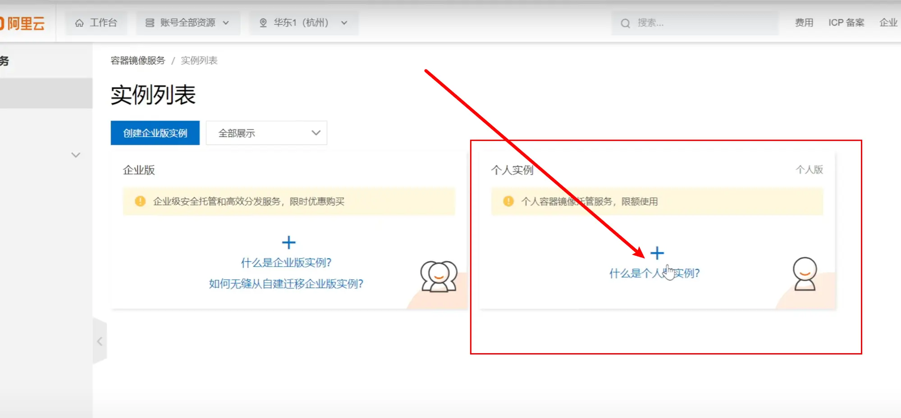
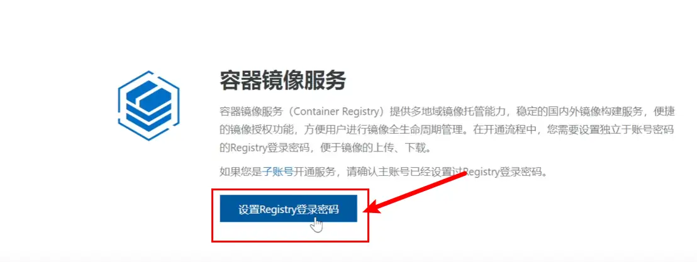
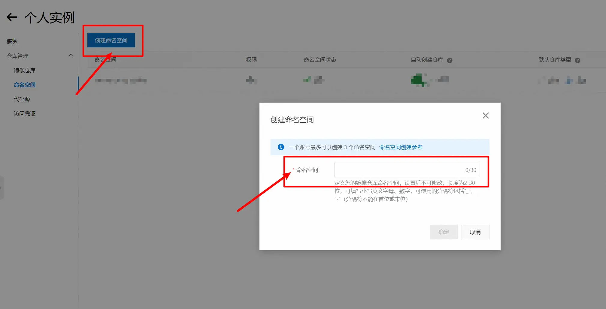
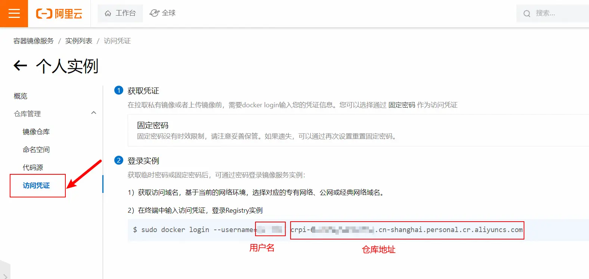
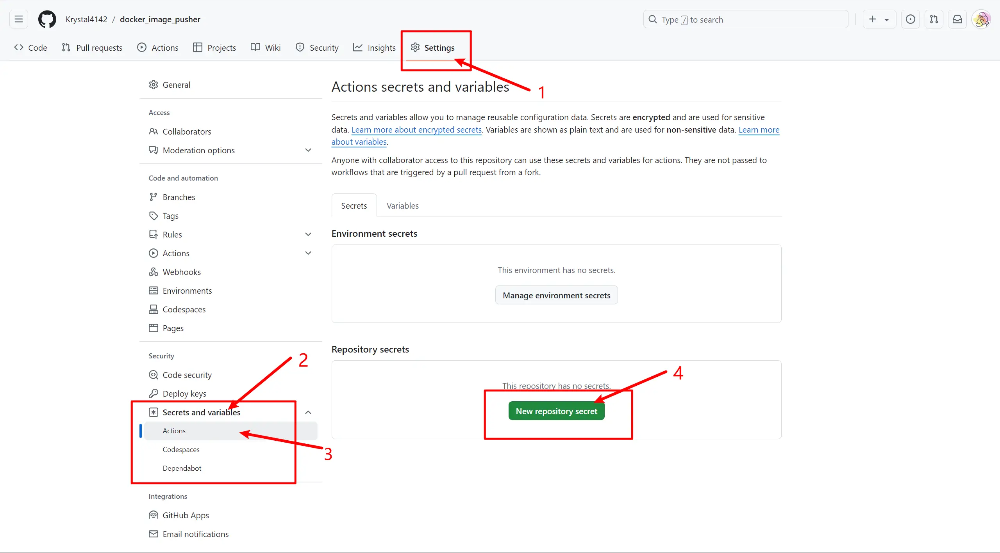
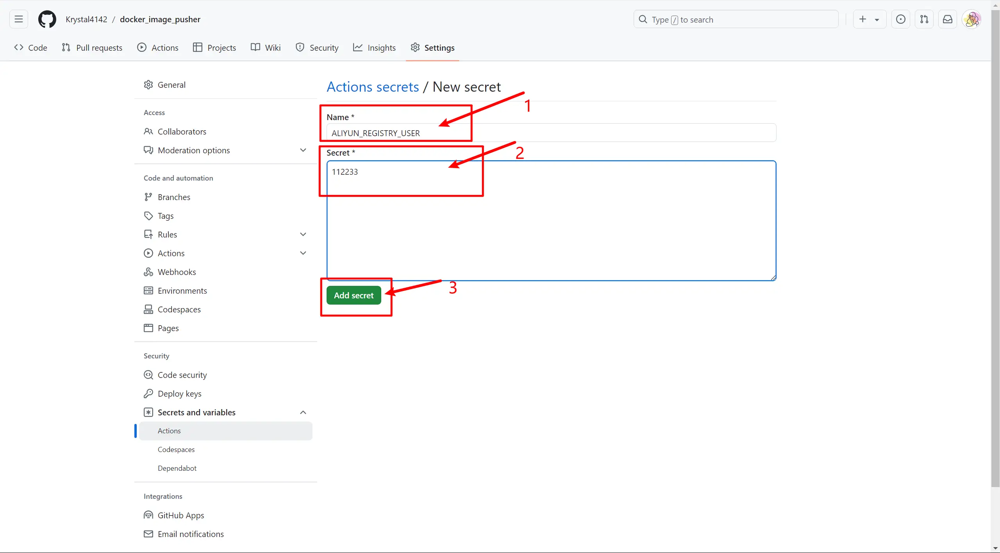

# Docker镜像自动构建与阿里云部署指南

## 项目简介

本项目提供了一个完整的工作流程，用于自动构建Docker镜像并将其部署到阿里云容器镜像服务。通过GitHub Actions，我们可以实现持续集成和自动化部署。

## 项目结构

- `.github/workflows/docker-image.yml` - GitHub Actions自动化工作流配置
- `.dockerfile` - Docker镜像构建模板（Node.js项目示例）

## 前期准备

- GitHub账号
- 阿里云账号
- 需要容器化的项目代码

## 配置指南

> 💡 本教程改编自：[阿里云搭建个人Docker镜像仓库（国内可用）](https://manmandong.top/%E9%98%BF%E9%87%8C%E4%BA%91%E6%90%AD%E5%BB%BA%E4%B8%AA%E4%BA%BADocker%E9%95%9C%E5%83%8F%E4%BB%93%E5%BA%93%EF%BC%88%E5%9B%BD%E5%86%85%E5%8F%AF%E7%94%A8%EF%BC%89/)

### 配置步骤

1. 登录[阿里云容器镜像服务控制台](https://cr.console.aliyun.com/)

2. 创建个人实例
   

3. 获取所需参数

   您需要依次获取以下四个参数，它们将用于GitHub Actions的配置：

   | 参数名称 | 环境变量 | 说明 | 
   |---------|----------|------|
   | 访问密码 | ALIYUN_REGISTRY_PASSWORD | 用于访问阿里云镜像仓库的认证密码 |
   | 命名空间 | ALIYUN_NAME_SPACE | 镜像仓库的命名空间，用于组织和管理镜像 |
   | 用户名 | ALIYUN_REGISTRY_USER | 阿里云账号的用户名 |
   | 仓库地址 | ALIYUN_REGISTRY | 阿里云镜像仓库的访问地址 |

4. 参数获取步骤

   a. 设置访问密码 (ALIYUN_REGISTRY_PASSWORD)
   

   b. 创建命名空间 (ALIYUN_NAME_SPACE)
   

   c. 获取用户名和仓库地址 (ALIYUN_REGISTRY_USER, ALIYUN_REGISTRY)
   

5. 配置GitHub Secrets

   将上述参数添加到GitHub项目的Secrets中：
   
   a. 进入项目的 Settings > Secrets and variables > Actions
   

   b. 添加所有必需的环境变量
   

   配置示例：
   ```plaintext
   Name: ALIYUN_REGISTRY_PASSWORD
   Value: 您的访问密码

   Name: ALIYUN_NAME_SPACE
   Value: 您的命名空间

   Name: ALIYUN_REGISTRY_USER
   Value: 您的用户名

   Name: ALIYUN_REGISTRY
   Value: 您的仓库地址
   ```

## 注意事项

- 🔒 安全提醒：所有敏感信息必须通过GitHub Secrets管理，切勿直接写入代码
- 🔄 本方案特点：直接构建自定义镜像并推送至阿里云，区别于从DockerHub迁移镜像的方案
- 🌐 网络优化：使用阿里云镜像服务可显著提升国内访问速度

## 常见问题

如遇到问题，请检查：
- GitHub Secrets 是否正确配置
- 阿里云访问权限是否开启
- Docker配置文件语法是否正确

## 贡献指南

欢迎提交Issue和Pull Request来完善本项目。